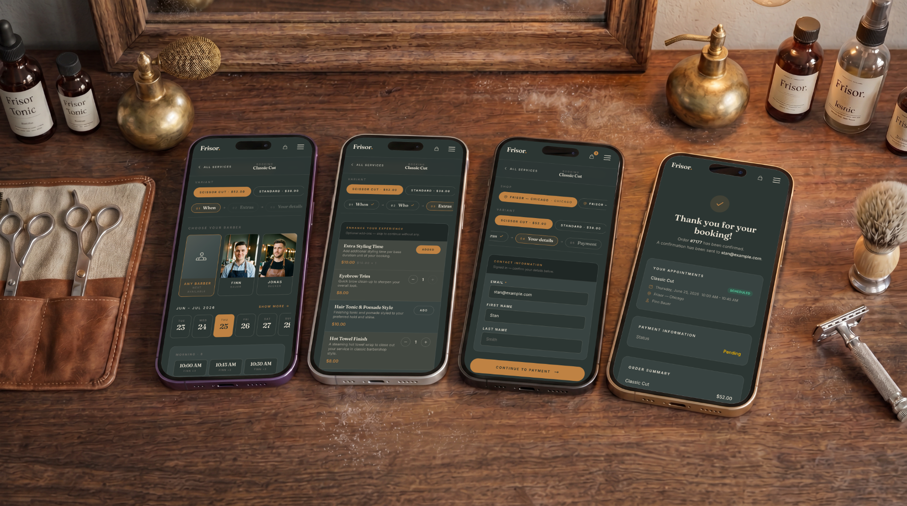
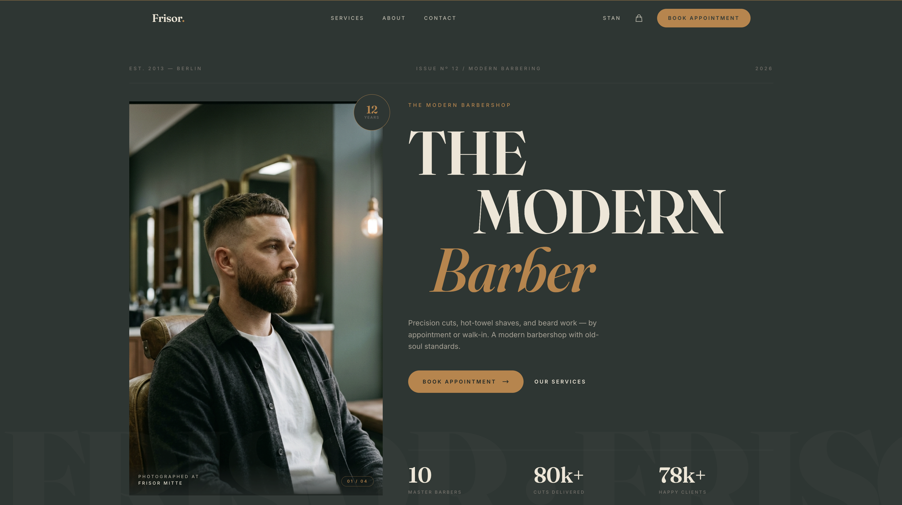
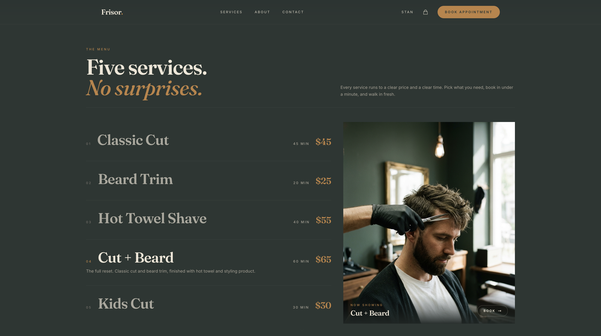
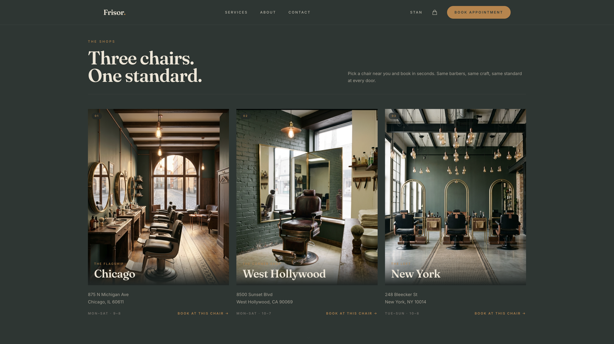
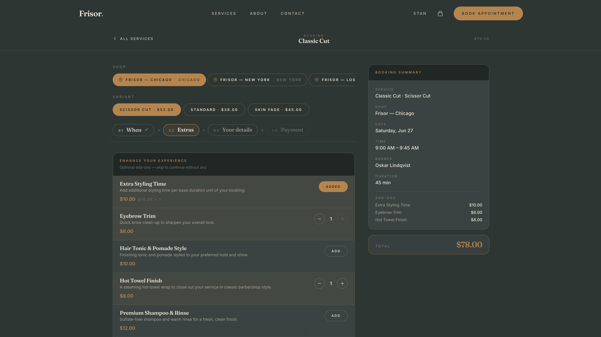
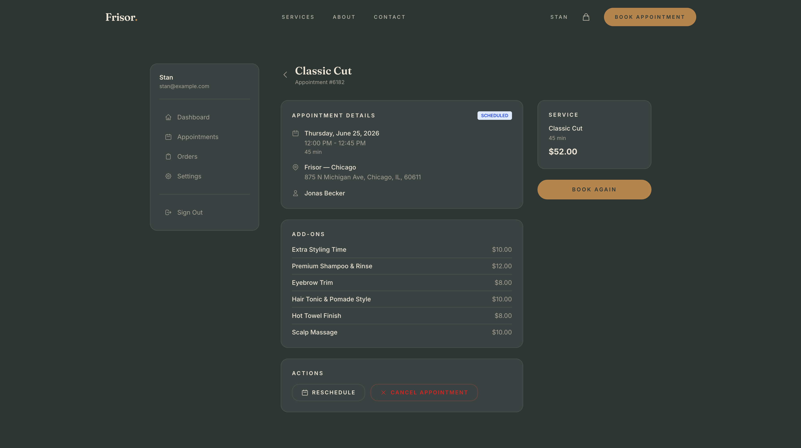

# Frisor — Next.js Barbershop Booking Template

A production-ready booking website for modern barbershops. Built with **Next.js 15**, **Tailwind CSS v4**, and the **Opencals Storefront SDK**.

**[View Live Demo →](https://template-frisor-sage.vercel.app)**



Dark editorial palette (deep green + gold), mobile-first booking flow inspired by native apps, and a full storefront — services, appointments, checkout, customer accounts — wired up out of the box. MIT licensed: clone it, rebrand it, ship it.

---

## Get Started in 3 Steps

### 1. Create an Opencals account

Sign up at **[app.opencals.com](https://app.opencals.com)** and create a **Dev Store**. When prompted for a dataset, choose the **Barbershop / Frisor** preset — this seeds your store with the barber services, staff, and locations so your template looks exactly like the demo.

### 2. Get your API key

Go to your **User Account Settings** in the Opencals dashboard and generate a **Storefront API key**. You'll need this to connect the template to your store.

### 3. Deploy to Vercel

[](https://vercel.com/new/clone?repository-url=https%3A%2F%2Fgithub.com%2Fletsopencals%2Ftemplate-frisor&env=OPENCALS_API_KEY,AUTH_SECRET&envDescription=API%20key%20from%20your%20Opencals%20dashboard%20and%20a%20random%20secret%20for%20auth&project-name=frisor&repository-name=frisor)

During deployment, Vercel will ask you to set environment variables:

| Variable | Value |
|----------|-------|
| `OPENCALS_API_KEY` | Your Storefront API key (starts with `sfk_`) |
| `AUTH_SECRET` | Any random string — used for session encryption |
| `NEXT_PUBLIC_STRIPE_PUBLISHABLE_KEY` | *(optional)* Stripe publishable key for payments |

That's it. Once deployed, you'll have the same fully functional booking site as the [live demo](https://template-frisor-sage.vercel.app).

---

## The Storefront

An editorial homepage, a clear service menu, and a multi-location "shops" section — all driven by your Opencals data.







---

## What's Included

### Online Booking
A single-page, card-stack booking flow inspired by native mobile apps: pick service → location → barber → date → time → confirm. Sticky bottom CTA on mobile, sticky summary rail on desktop.



### Add-Ons at Checkout
Optional extras — hot towel finish, beard oil treatment, eyebrow trim, hair tonic & pomade style — add to the booking and update the live summary total in one transaction.

### Service Variants
Products can have multiple variants (e.g. "Classic Cut" → Standard, Scissor Cut, Skin Fade), each with their own pricing, duration, and assigned staff.

### Multi-Location Support
Global location selector, staff filtered by location, and per-location availability across all three shops.

### Checkout with Stripe
Multi-step checkout with customer info, custom questions, and secure payment via Stripe Elements. Auto-login after checkout so the customer lands in their account with the new appointment.

### Customer Accounts
Sign in, view appointments, browse order history, manage profile, and reschedule or cancel appointments.



### Mobile-First Design
Fully responsive. The booking page in particular is designed mobile-first — the iPhone booking flow shown at the top of this README is the live template, not a mockup.

### SEO Ready
Per-page metadata, Open Graph cards, robots.txt, and sitemap.xml — configured out of the box.

---

## Tech Stack

| Category | Technology |
|----------|-----------|
| Framework | Next.js 15 (App Router) |
| Styling | Tailwind CSS v4 |
| Animations | Framer Motion |
| Forms | react-hook-form + Zod |
| Payments | Stripe Elements |
| Auth | NextAuth.js v5 |
| Dates | moment-timezone |
| API | Opencals Storefront SDK |

---

## Local Development

```bash
git clone <repository-url>
cd frisor-barbershop-template
npm install
cp .env.example .env
```

Edit `.env` with your values:

```
OPENCALS_API_KEY=sfk_your_key_here
AUTH_SECRET=change_me_to_a_random_string
```

```bash
npm run dev
```

Open [http://localhost:3000](http://localhost:3000).

---

## Customization

### Branding & Content

All barbershop-specific copy is centralized in **`lib/site-config.ts`**:

- Shop name, tagline, logo wordmark
- Homepage hero text, stats, mission tiles, testimonials
- About page story, team members, values
- Contact information (address, phone, email, hours)
- Footer links and social media

Edit this single file to rebrand the entire template.

### Theme Colors

Design tokens live in **`app/globals.css`** as Tailwind v4 `@theme` properties:

```css
@theme {
  --color-bg: #0F1B17;           /* near-black green */
  --color-surface: #1E2E29;      /* card / panel green */
  --color-surface-2: #2A3F3A;    /* elevated panel */
  --color-cream: #EFE9DA;        /* warm off-white text */
  --color-gold: #E8B547;         /* primary CTA gold */
  --font-display: 'Fraunces', 'Playfair Display', Georgia, serif;
  --font-body: 'Inter', system-ui, sans-serif;
}
```

### Imagery

Drop hero, gallery, team, and service images into `public/images/{hero,gallery,team,services,about}/`. See **`public/PLACEHOLDERS.md`** for required filenames and recommended dimensions.

### Adding Pages

1. Create `app/your-page/page.tsx`
2. Add a `layout.tsx` with metadata
3. Add the link to `navLinks` in `components/layout/header.tsx`

---

## Project Structure

```
app/
  page.tsx                    # Homepage
  services/page.tsx           # Service listing
  booking/[slug]/page.tsx     # Card-stack booking page
  checkout/page.tsx           # Multi-step checkout
  thank-you/page.tsx          # Post-checkout confirmation
  about/                      # About page
  contact/                    # Contact form + info
  account/                    # Customer dashboard
  auth/                       # Sign in, sign up, password reset
  api/                        # API routes proxy SDK calls server-side

components/
  layout/{header,footer}.tsx  # Site chrome
  home/                       # Hero, stats band, services, gallery, mission, testimonials, banner
  booking/                    # Date picker, time slots, staff/location selectors
  checkout/                   # Multi-step form components
  cart/cart-drawer.tsx

contexts/                     # cart, checkout, location, timezone
hooks/                        # use-api-request, use-form-submit, use-date-formatter
lib/                          # site-config, opencals (SDK), auth (NextAuth), schemas, format, utils
```

## Environment Variables

| Variable | Required | Description |
|----------|----------|-------------|
| `OPENCALS_API_KEY` | Yes | Storefront API key from your Opencals dashboard |
| `AUTH_SECRET` | Yes | Random string for NextAuth session encryption |
| `NEXT_PUBLIC_STRIPE_PUBLISHABLE_KEY` | No | Stripe publishable key for payment processing |
| `OPENCALS_API_URL` | No | Override API base URL (defaults to production) |
| `NEXT_PUBLIC_BASE_URL` | No | Public site URL (for sitemap) |

---

## Other Templates

Frisor is one of the open-source booking templates built on the Opencals Storefront SDK. Same backend, different design and vertical:

- **[HAAR](https://github.com/letsopencals/template-haar)** — a hair-salon booking template with a light, warm palette. [Live demo](https://template-haar.vercel.app)

See all templates and the Storefront API at **[opencals.com/developers](https://opencals.com/developers)**.

## License

MIT
